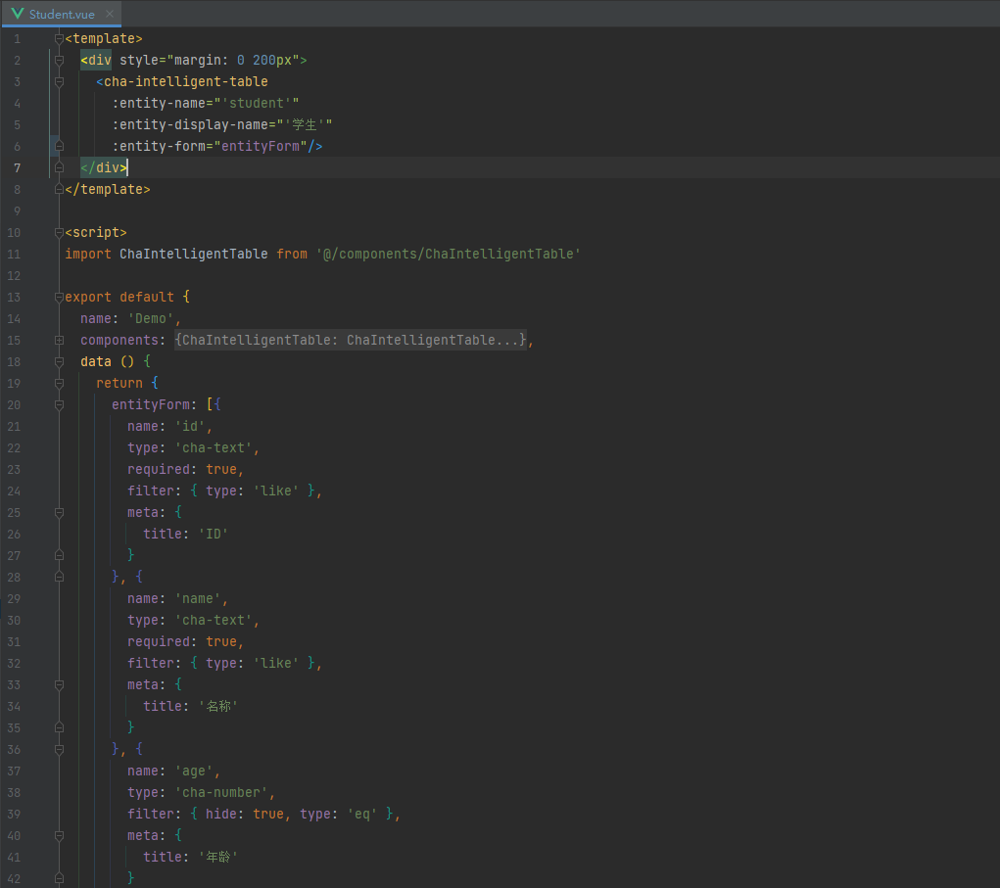

# 猹(?)表 - ChaIntelligentTable
一款基于 Vue3、Element-plus 组件，通过数组生成后台表格页面的组件

（我承认文案有点烂orz）

README 仍在更新中 可用参数应该不止下图这么一点点😎


👇简单的代码即可生成如下页面👇（mockjs模拟后端）


## 运行示例
```
yarn install
```

### Compiles and hot-reloads for development
```
yarn serve
```

### Compiles and minifies for production
```
yarn build
```

### Lints and fixes files
```
yarn lint
```

### Customize configuration
See [Configuration Reference](https://cli.vuejs.org/config/).
